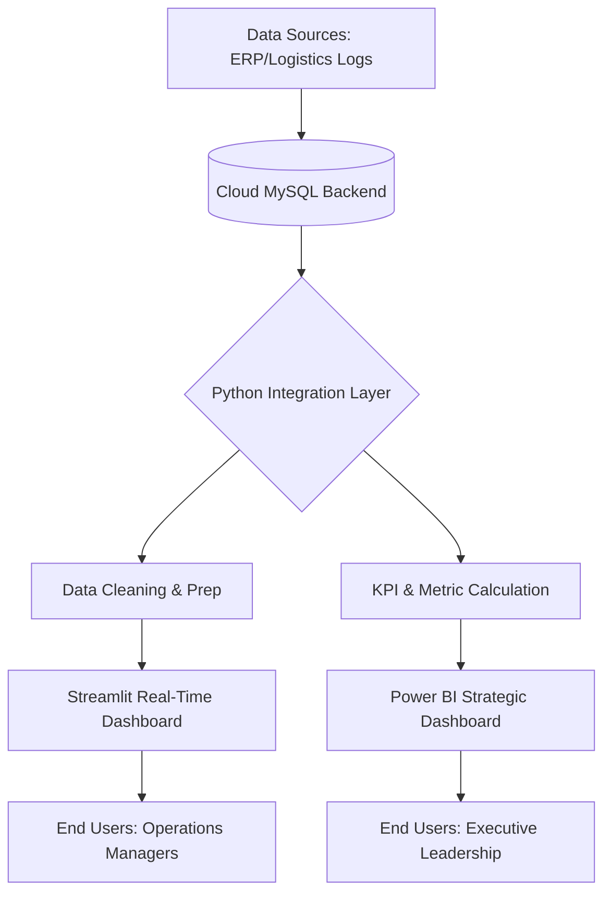

# Supply Chain Dashboard

A Data Analyst project visualizing supply chain metrics using Streamlit, Python, and MySQL.

Deployed webpage version can be accessed from here https://supply-chain-data-dashboarding-with-mysql-cloud-backend.streamlit.app/

## Features
- **KPIs**: Total Revenue, Average Lead Time, Total Products Sold.
- **Visualizations**:
    - Revenue & Lead Time by Transportation Mode.
    - Revenue by Product Type & Demographics.
    - Location Analysis.
- **Data Export**: Download raw data as CSV.
- **Database Integration**: Connects to a local MySQL database.

## Setup

1.  **Prerequisites**:
    -   Python 3.8+
    -   MySQL Server
    -   Database `startersql` with `supply_chain` table.

2.  **Installation**:
    ```bash
    pip install -r requirements.txt
    ```

3.  **Database Configuration**:
    -   Update `db_utils.py` with your MySQL credentials if they differ from the default:
        -   User: `root`
        -   Password: `admin1234`
        -   Database: `startersql`

4.  **Run the App**:
    ```bash
    streamlit run app.py
    ```

## Project Structure
- `app.py`: Main application file.
- `db_utils.py`: Database connection and data fetching logic.
- `requirements.txt`: Python dependencies.

This is a comprehensive, professional `README.md` for your **Supply Chain Data Dashboarding** project. It incorporates the system architecture, technical flow, and the business importance we discussed.

---

# 🌐 Supply Chain Data Dashboarding & Cloud Analytics

**A centralized "Control Tower" for modern logistics.** This project integrates a cloud-native MySQL backend with advanced Python-based data processing and interactive Power BI visualizations to provide real-time visibility into global supply chain operations.

---

## 🚀 Key Features

* **Cloud-Integrated Backend**: Centralized storage of logistics, inventory, and procurement data using a MySQL cloud instance for high availability and scalability.
* **Automated Data Pipeline**: Seamless flow of data from raw SQL records to cleaned, analysis-ready datasets using Python.
* **Operational Control Tower**: Interactive dashboards tracking critical metrics like **Inventory Turnover**, **Lead-Time Variance**, and **Order Fulfillment Rates**.
* **Predictive Logistics Insights**: Identifying potential bottlenecks and stockouts before they impact the bottom line.
* **Multi-Platform Reporting**: Detailed strategic analysis via Power BI combined with agile, web-based monitoring via Streamlit.

---

## 🏗️ System Architecture

This project follows a multi-tier architectural approach to bridge the gap between fragmented raw data and executive decision-making.



### Data Flow & Component Breakdown

1. **Cloud Data Layer (MySQL)**: Acts as the "Single Source of Truth," centralizing data from various supply chain nodes to ensure consistency across the organization.
2. **Integration Layer (Python)**: Utilizes secure SQL connectors to ingest data. It handles complex transformations, such as normalizing lead times and calculating safety stock levels.
3. **Visualization Layer**:
* **Streamlit**: Focuses on high-frequency, tactical monitoring (e.g., *Current Warehouse Capacity*).
* **Power BI**: Focuses on long-term strategic trends (e.g., *Year-over-Year Vendor Performance*).


---

## 🛠️ Tech Stack

* **Database**: MySQL (Cloud-hosted)
* **Languages**: Python 3.x, SQL
* **Libraries**: Pandas, SQLAlchemy, NumPy, Streamlit, Matplotlib
* **Business Intelligence**: Microsoft Power BI
* **Environment**: Docker (optional), `.env` for secure credential management

---

## 📊 Why This Project is Important

In an era of global volatility, supply chain visibility is a critical competitive advantage. This project addresses several key industry challenges:

* **Operational Resilience**: Provides the transparency needed to spot logistics delays early, allowing managers to pivot strategies before disruptions become critical.
* **Bottom-Line Optimization**: By identifying inefficiencies in warehousing and shipping costs, businesses can directly increase profit margins through data-driven procurement.
* **Strategic Agility**: Moves organizations away from manual, error-prone spreadsheets toward an automated system that supports rapid demand forecasting.
* **Vendor Accountability**: Establishes hard-data benchmarks to hold suppliers and third-party logistics (3PL) providers accountable to their Service Level Agreements (SLAs).

---

## 💻 Setup & Installation

### 1. Database Configuration

Ensure your Cloud MySQL instance is running. Create a `.env` file in the root directory:

```env
DB_HOST=your_cloud_host
DB_USER=your_username
DB_PASSWORD=your_password
DB_NAME=supply_chain_db

```

### 2. Environment Setup

```bash
# Clone the repository
git clone https://github.com/Saifuq/Supply-Chain-data-dashboarding-with-mysql-cloud-backend.git

# Install dependencies
pip install -r requirements.txt

```

### 3. Run the Dashboard

```bash
streamlit run src/app.py

```

---

## 📈 Dashboard Highlights

*(Note: You can add your Power BI screenshots here to showcase the visual impact)*

* **Heatmaps**: For identifying high-cost shipping routes.
* **Gauges**: For real-time tracking of inventory health.
* **Trend Lines**: For forecasting future demand based on historical cycles.

---


